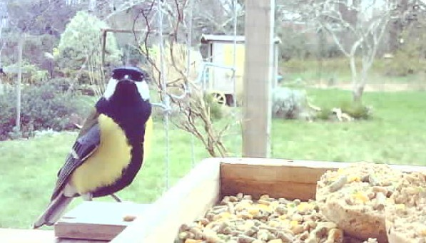

# CeKiKeLa ESP32-Cam
  
Cekikela-esp32-cam is an application for the ESP32-Cam platform.  
Triggered by a PIR or an internal timer, it takes a picture
and saves it on SD card and/or uploads it to a web server.  
The application is fully configurable by instructions and by file stored on the SD card.  
  

  
The project is named CeKiKeLa which means "C'est qui qu'est là ?"" i.e. "Who's there?".  
It is hosted by the 'fab lab' MakerSpace56 (https://makerspace56.org).  
It aims to take picture of birds (passerines) like robins and chickadees.  
  
Usage:
- In the Arduino IDE, select Board "AI Thinker ESP32-CAM"
- To enable the OTA feature, select the right partition scheme (Arduino IDE > Tool > Partition scheme): "Minimal SPIFFS (1.9MB APP with OTA /190KB SPIFFS)"
- If you use a PIR, connect it to GPIO 12

Special thanks to Rui Santos for its project details at https://RandomNerdTutorials.com/esp32-cam-take-photo-save-microsd-card  
See also https://randomnerdtutorials.com/esp32-timer-wake-up-deep-sleep/
  
Licensed under LGPL version 2.1 a version of which should have been supplied with this file.  
  
Github: https://github.com/smolltalk/cekikela-esp32-cam  
Author: Sébastien Morvan (morvan.sebastien@gmail.com)  

## Getting started
  
There are two ways to load the application on the ESP32-Cam board:
- Clone this project and use the Arduino IDE to [build](#build-binary) and load the binary to the board
- Get the latest release binary and [flash the board with it](#flash-binary)
  
In both options, you can configure the application via the configuration file `config.txt`stored on a SD card.  
To know which parameters to tune, refer to the [examples](#configuration-examples) and to the [Settings section](#settings).
Note that the first option allows you to customize the code, especially the function `initAppConfigWithCustomValues()` in `config.cpp`.
  
If the application does not work as expected, refer to the [Status codes section](#status-codes).

## Releases

- Latest version: 0.1.0.

## Configuration examples  

### Example #1

This example shows how to setup the application to 
- take picture on the PIR signal
- save the picture on the SD card
- upload the pictures by bunch of 10 pictures

`config.txt` on SD card:

```ini
savePictureOnSdCard=true
awakeDurationMs=5000
deepSleepDurationSec=0

[wifi]
enabled=true
ssid=MyWifiSSID
password=MyWifiPassword
connectAttemptMax=30

[upload]
enabled=true
serverAddress=myserver.picture.com
serverPort=80
path=/upload.php
auth=MyUploadPassword

[camera]
getReadyDelayMs=1500

[sensor]
gain_ctrl=1
exposure_ctrl=1
awb_gain=1
brightness=1
gainceiling=1
```

### Example #2

This example shows how to setup the application to 
- take picture on the PIR signal
- save the picture on the SD card
- upload the pictures by bunch of 10 pictures

`config.cpp`

```C
#include "cfgmgt.h"

/**
 * @brief Set the application configurations attributes with custom values.
 *        It's the place where you, customer, can set the configuration
 *        attributes programmatically.
 *        Else, you can use the configuration file on SD card.
 *        See readme.md.
 */
void initAppConfigWithCustomValues(app_config_t * appConfig) {
  // **** General ****
    
  // Save picture on SD card
  appConfig->savePictureOnSdCard = true;
  // Still awaken 5000ms before going in deep sleep mode
  appConfig->awakeDurationMs = 5000;
  // Do not periodically wake up the board
  appConfig->deepSleepDurationSec = 0;

  // **** WiFi ****
  
  // Enable WiFi connection
  appConfig->wifi.enabled = true;
  // WiFi SSID
  strcpy(appConfig->wifi.ssid, "MyWifiSSID");
  // WiFi password
  strcpy(appConfig->wifi.password, "MyWifiPassword");
  // 30 connection attempts max
  appConfig->wifi.connectAttemptMax = 30;
  
  // **** Upload ****
  
  // Enable pictures upload
  appConfig->upload.enabled = true;
  // Address of the server receiving pictures
  strcpy(appConfig->upload.serverAddress, "myserver.picture.com");
  // Listening TCP port of the server receiving pictures
  appConfig->upload.serverPort = 80;
  // Upload path of the service receiving data
  strcpy(appConfig->upload.path, "/upload.php");
  // Authentication to keep the upload private
  strcpy(appConfig->upload.auth, "MyUploadPassword");
  
  // **** Camera ****
  
  appConfig->camera.getReadyDelayMs = 1500;
  
  // **** Camera sensor ****
  
  setSensorSetting(&(appConfig->camera.sensor.gain_ctrl), 1);      // Auto gain on
  setSensorSetting(&(appConfig->camera.sensor.exposure_ctrl), 1);  // Auto exposure on
  setSensorSetting(&(appConfig->camera.sensor.awb_gain), 1);       // Auto White Balance enable (0 or 1)
  setSensorSetting(&(appConfig->camera.sensor.brightness), 1);
  setSensorSetting(&(appConfig->camera.sensor.gainceiling), 1);
}
```

## Settings

|Name|Section|Description|Type|Range|Default value|config.cpp Example|config.txt Example|
|----|-------|-----------|----|-----|-------------|------------------|------------------|
|app_config_t.savePictureOnSdCard||When enabled, picture will be saved on the SD card|bool|true, false|true|`appConfig->savePictureOnSdCard = true;`|savePictureOnSdCard=true|
|app_config_t.awakeDurationMs||It defines a time delay in ms before sleep mode.<br/>This prevents picture bursts when the board is awakened by an untimely signal|uint16_t|[0, 65535]|2000|`appConfig->awakeDurationMs=5000;`|awakeDurationMs=5000|
|app_config_t.deepSleepDurationSec||It defines the sleep duration in seconds before the board will be waken up.<br/>A 0 value disables the feature.|uint16_t|[0, 65535]|0|`appConfig->deepSleepDurationSec=600;`|deepSleepDurationSec=600|
|wifi_settings_t.enabled|WiFi|It enables WiFi connections.<br/>WiFi is required to update time by NTP and to upload pictures.|bool|true, false|false|`appConfig->wifi.enabled = true;`|wifi.enabled=true|
|wifi_settings_t.ssid|WiFi|WiFi SSID, i.e. the name of your WiFi network|char *|31 characters max||`strcpy(appConfig->wifi.ssid, "MyWiFiSSID");`|wifi.ssid=MyWiFiSSID|
|wifi_settings_t.password|WiFi|WiFi network password|char *|31 characters max||`strcpy(appConfig->wifi.password, "MyWiFiPassword");`|wifi.password=MyWiFiPassword|
|wifi_settings_t.connectAttemptMax|WiFi|The max count of attempts to be connected|uint8_t|[0, 255]|30|`appConfig->wifi.connectAttemptMax = 30;`|wifi.connectAttemptMax=30|
|time_settings_t.enabled|Time|When enabled, the time is synchronized by NTP|bool|true, false|true|`appConfig->time.enabled = true;`|time.enabled=true|
|time_settings_t.ntpServer|Time|NTP server address|char *|63 characters max|pool.ntp.org|`strcpy(appConfig->time.ntpServer, "myntpserver.mydomain.com");`|time.ntpServer=myntpserver.mydomain.com|
|time_settings_t.gmtOffsetSec|Time|GMT offset in seconds (see configTime())|long|[-2B, 2B]|0|`appConfig->time.gmtOffsetSec = 7200;`|time.gmtOffsetSec=7200|
|time_settings_t.daylightOffsetSec|Time|Daylight offset in seconds (see configTime())|int|[-32768, 32767]|3600|`appConfig->time.dayLightOffsetSec = 0;`|time.dayLightOffsetSec=0|
|time_settings_t.syncTimePeriodHours|Time|Time synchronization is done periodically each syncTimePeriodHours|uint8_t|[0, 255]|24|`appConfig->time.syncTimePeriodHours = 48;`|time.syncTimePeriodHours=48|
|upload_settings_t.enabled|Upload|When set to true, pictures will be uploaded to a remote server according to the following parameters.|bool|true, false|false|`appConfig->upload.enabled=true;`|upload.enabled=true|
|upload_settings_t.serverAddress|Upload|Address of the server receiving pictures.|char *|63 characters max||`strcpy(appConfig->upload.path, "myserver.picture.com");`|upload.serverAddress=myserver.picture.com|
|upload_settings_t.serverPort|Upload|Listening TCP port of the server receiving pictures.|uint16_t|[1, 65535]|80|`appConfig->upload.serverPort=8080;`|upload.serverPort=8080|
|upload_settings_t.path|Upload|Upload path of the service receiving data.|char *|63 characters max||`strcpy(appConfig->upload.path, "/upload.php");`|upload.path=/upload.php|
|upload_settings_t.auth|Upload|Address of the server receiving pictures.|char *|31 characters max||`strcpy(appConfig->upload.auth, "MyUploadPassword");`|upload.auth=MyUploadPassword|
|upload_settings_t.bunchSize|Upload|Upload in packs of `bunchSize` when pictures are stored on SD card.|uint8_t|[0, 255]|10|`appConfig->upload.bunchSize=10;`|upload.bunchSize=10|
|upload_settings_t.fileNameRandSize|Upload|When the picture is not stored on the SD card,<br/>a random file name is computed.<br/>Its format is `pic-random.jpg` where `random` is randomly composed of numbers and letters.<br/>`fileNameRandSize` defines the length of the random part.|uint8_t|[1, 8]|5|`appConfig->upload.fileNameRandSize=5;`|upload.fileNameRandSize=5|
|camera_settings_t.getReadyDelayMs|Camera|Time required to let the sensor be ready. A delay of 1500ms prevents 'green' pictures.|uint16_t|[0, 65535]|1500|`appConfig->camera.getReadyDelayMs=1500`|camera.getReadyDelayMs=1500|
|sensor_settings_t.contrast|Camera Sensor|Set contrast.|int|[-2, 2]|0|`setSensorSetting(&(appConfig->camera.sensor.contrast), 0)`|sensor.contrast=|
|sensor_settings_t.brightness|Camera Sensor|Set brightness.|int|[-2, 2]|0|`setSensorSetting(&(appConfig->camera.sensor.brightness), 0)`|sensor.brightness=|
|sensor_settings_t.saturation|Camera Sensor|Set saturation.|int|[-2, 2]|0|`setSensorSetting(&(appConfig->camera.sensor.saturation), 0)`|sensor.saturation=|
|sensor_settings_t.special_effect|Camera Sensor|Set a special effect: 0 - No Effect, 1 - Negative, 2 - Grayscale, 3 - Red Tint, 4 - Green Tint, 5 - Blue Tint, 6 - Sepia.|int|[0, 6]|0|`setSensorSetting(&(appConfig->camera.sensor.special_effect), 2)`|sensor.special_effect=2|
|sensor_settings_t.gainceiling|Camera Sensor|0 = 2X, 1 = 4X, 2 = 8X, 3 = 16X, 4 = 32X, 5 = 64X, 6 = 128X.|int|[0-6]|0|`setSensorSetting(&(appConfig->camera.sensor.gainceiling), 0)`|sensor.gainceiling=0|
|sensor_settings_t.framesize|Camera Sensor|0 = 96X96, 1 = QQVGA (160x120), 2 = QCIF (176x144), 3 = HQVGA (240x176), 4 = 240X240 (240x240), 5 = QVGA (320x240), 6 = CIF (400x296), 7 = HVGA (480x320), 8 = VGA (640x480), 9 = SVGA (800x600), 10 = XGA (1024x768), 11 = HD (1280x720), 12 = SXGA (1280x1024), 13 = UXGA (1600x1200), [3MP Sensors] 14 = FHD (1920x1080), 15 = P_HD (720x1280), 16 = P_3MP (864x1536), 17 = QXGA (2048x1536), [5MP Sensors] 18 = QHD (2560x1440), 19 = WQXGA (2560x1600), 20 = P_FHD (1080x1920), 21 = QSXGA (2560x1920)|int|[0-21]|10|`setSensorSetting(&(appConfig->camera.sensor.framesize), 11)`|sensor.framesize=11|
|sensor_settings_t.pixformat|Camera Sensor|0 = 2BPP/RGB565, 1 = 2BPP/YUV422, 2 = 1.5BPP/YUV420, 3 = 1BPP/GRAYSCALE, 4 = JPEG/COMPRESSED, 5 = 3BPP/RGB888, 6 = RAW, 7 = 3BP2P/RGB444, 8 = 3BP2P/RGB555|int|[0-8]|4|`setSensorSetting(&(appConfig->camera.sensor.pixformat), 4)`|sensor.pixformat=4|
|sensor_settings_t.whitebal|Camera Sensor|Set white balance: 0 = disable, 1 = enable.|int|[0, 1]|1|`setSensorSetting(&(appConfig->camera.sensor.whitebal), 0)`|sensor.whitebal=0|
|sensor_settings_t.awb_gain|Camera Sensor|Set white balance gain: 0 = disable, 1 = enable.|int|[0, 1]|1|`setSensorSetting(&(appConfig->camera.sensor.awb_gain), 0)`|sensor.awb_gain=0|
|sensor_settings_t.wb_mode|Camera Sensor|Set white balance mode: 0 to 4 - if awb_gain enabled (0 - Auto, 1 - Sunny, 2 - Cloudy, 3 - Office, 4 - Home).|int|[0, 4]|0|`setSensorSetting(&(appConfig->camera.sensor.wb_mode), 0)`|sensor.wb_mode=|
|sensor_settings_t.exposure_ctrl|Camera Sensor|Set exposure control: 0 = disable, 1 = enable.|int|[0, 1]|1|`setSensorSetting(&(appConfig->camera.sensor.exposure_ctrl), 0)`|sensor.exposure_ctrl=0|
|sensor_settings_t.aec2|Camera Sensor||int|[0, 1]|0|`setSensorSetting(&(appConfig->camera.sensor.aec2), 0)`|sensor.aec2=0|
|sensor_settings_t.ae_level|Camera Sensor||int|[-2, 2]|0|`setSensorSetting(&(appConfig->camera.sensor.ae_level), 0)`|sensor.ae_level=0|
|sensor_settings_t.aec_value|Camera Sensor||int|[0, 1200]|204|`setSensorSetting(&(appConfig->camera.sensor.aec_value), 0)`|sensor.aec), 0|
|sensor_settings_t.gain_ctrl|Camera Sensor|0 = disable, 1 = enable.|int|[0, 1]|1|`setSensorSetting(&(appConfig->camera.sensor.gain_ctrl), 0)`|sensor.gain_ctrl=0|
|sensor_settings_t.agc_gain|Camera Sensor||int|[0, 30]|0|`setSensorSetting(&(appConfig->camera.sensor.agc_gain), 0)`|sensor.agc_gain=0|
|sensor_settings_t.bpc|Camera Sensor|0 = disable, 1 = enable.|int|[0, 1]|0|`setSensorSetting(&(appConfig->camera.sensor.bpc), 0)`|sensor.bpc=0|
|sensor_settings_t.wpc|Camera Sensor|0 = disable, 1 = enable.|int|[0, 1]|1|`setSensorSetting(&(appConfig->camera.sensor.wpc), 0)`|sensor.wpc=0|
|sensor_settings_t.raw_gma|Camera Sensor|0 = disable, 1 = enable.|int|[0, 1]|1|`setSensorSetting(&(appConfig->camera.sensor.raw_gma), 0)`|sensor.raw_gma=0|
|sensor_settings_t.lenc|Camera Sensor|Set lens correction: 0 = disable, 1 = enable.|int|[0, 1]|1|`setSensorSetting(&(appConfig->camera.sensor.lenc), 0)`|sensor.lenc=0|
|sensor_settings_t.hmirror|Camera Sensor|Horizontal mirrot: 0 = disable, 1 = enable.|int|[0, 1]|0|`setSensorSetting(&(appConfig->camera.sensor.hmirror), 0)`|sensor.hmirror=0|
|sensor_settings_t.vflip|Camera Sensor|Vertical flip: 0 = disable, 1 = enable.|int|[0, 1]|0|`setSensorSetting(&(appConfig->camera.sensor.vflip), 0)`|sensor.vflip=0|
|sensor_settings_t.colorbar|Camera Sensor|0 = disable, 1 = enable.|int|[0, 1]|0|`setSensorSetting(&(appConfig->camera.sensor.colorbar), 0)`|sensor.colorbar=|
|sensor_settings_t.dcw|Camera Sensor||int||1|`setSensorSetting(&(appConfig->camera.sensor.dcw), 0)`|sensor.dcw=|
|sensor_settings_t.sharpness|Camera Sensor||int||0|`setSensorSetting(&(appConfig->camera.sensor.sharpness), 0)`|sensor.sharpness=|
|sensor_settings_t.denoise|Camera Sensor||int||0|`setSensorSetting(&(appConfig->camera.sensor.denoise), 0)`|sensor.denoise=0|
|sensor_settings_t.quality|Camera Sensor||int||16|`setSensorSetting(&(appConfig->camera.sensor.quality), 0)`|sensor.quality=0|

Further details are available in `sensor.h` and [here](https://randomnerdtutorials.com/esp32-cam-ov2640-camera-settings/).

## Status codes

When the application fails, the built-in LED flashes 
as many times as the numerical value associated with the status code.

Use the following table to convert the number of flashes to a status code.

|Number of flashes|Description|Fix|
|-----------------|-----------|---|
|0|Sucessful||
|1|Failed to detect or initialize the camera sensor|Reset|
|2|Failed to take a picture|Reset|
|3|Failed to detect or mount the SD card|Unmount/mount the SD card and ensure it's still FAT formatted|
|4|Failed to read a file on the SD card|Check that the file exists|
|5|Failed to write a file on the SD card|Check that the file exists and that the card has free space|
|6|Failed to initialize the WiFi|Check the WiFi settings|
|7|Failed to upload the picture|Check the upload settings|
|8|Failed to read the configuration file|Check the configuration file|

## Build binary

- Use the Arduino IDE (2.2.1, for example)
- Install ESP32 boards support. [See this documentation](https://randomnerdtutorials.com/installing-the-esp32-board-in-arduino-ide-windows-instructions/).
- Select the platform "AI Thinker ESP32-CAM"
- To enable the OTA feature, the recommanded partition scheme is "Minimal SPIFFS (1.9MB APP with OTA/190 KB SPIFFS)"
- Ensure that the following libraries are installed:
  - FileConfig@1.0.0
- Verify / Compile / Upload

## Flash binary

- Get the latest binary
- Get [Flash Download Tools from Espressif](https://www.espressif.com/en/support/download/other-tools)
- Launch flash_download_tool_x.y.z.exe
- Select ESP32 in ChipType and Develop in WorkMode, then click OK
- Configure like this:
  - Add file cekikela-esp32-cam.ino.bootloader.bin at the address 0x1000
  - Add file cekikela-esp32-cam.ino.partitions.bin at the address 0x8000
  - Add file boot_app0.bin at the address 0xe000 
  - Add file cekikela-esp32-cam.ino.bin at the address 0x10000  
- Check all the files
- Select 80Mhz in SPI speed
- Select DIO in SPI mode
- Select your COM port
- Select 460800 in Baud
- Then Start

## TODO
- SD card formatting
- OTA explanation